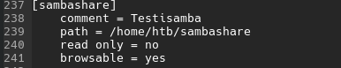
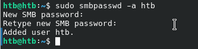
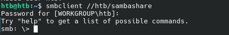
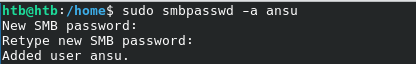

# h4 Pizza Fantasia
Kotitehtävä h4 Pizza Fantasia Tero Karvisen  2026 kevät -kurssille. [Linkki kurssisivulle](https://terokarvinen.com/palvelinten-hallinta/)
Jokaisessa kohdassa on alla olevalla "quote" tyylillä kerrottu tehtävänanto.
>Liirum laarum laa...

## x
> Lue ja tiivistä. (Tässä x-alakohdassa ei tarvitse tehdä testejä tietokoneella, vain lukeminen tai kuunteleminen ja tiivistelmä riittää. Tiivistämiseen riittää muutama ranskalainen viiva. Ei siis vaadita pitkää eikä essee-muotoista tiivistelmää. Lisää kuhunkin jokin oma kysymys tai huomio.)
> Karvinen 2023: [Configuration Management of Distributed Systems over Unreliable and Hostile Networks](https://westminsterresearch.westminster.ac.uk/item/w7vvz/configuration-management-of-distributed-systems-over-unreliable-and-hostile-networks) (pdf, ̣mirrors: local, archive.org), vain nämä kohdat:
> 4.12.1 Size and Complexity of Some DSLs (112. Ominaisuuksien määrä.)
- DSL = Domain specific language
- Saltin DSL:ssa (Versiossa 2017.7.4) on 510 eri tilafunktiota joilla käyttäjä voi hallita hallitsemiaan koneita.
- Näiden 510 tilafunktion dokumentaatio on yli 75 000 sanaa.
- Puppet on Saltin tapainen keskitetyn hallinan työkalu.
- Puppetissa oletuksena 113 "funktiota"
- Puppetin funktiot toimivat eri tavalla kuin ohjelmointikielien funktiot. Puppet määrittää uusia resurrseija ja niille yhteydet.

> 4.12.2 Use of DSL Functions in Case Configuration (112-115. Mitä oikeasti käytetään.)
- Mozillan engineering puppet Manifestissa 3 yleisintä functiota ja control structurea olivat case(control structure), file ja package (molemmat funktiota). Näiden määrä oli melkein puolet 49% käytetyistä funktioista, control structuresta sekä "internally defined" komennoista.
- United States Government Configuration Baseline (USGCB) kolme yleisintä komentoa olivat augeas, file ja service. Näiden määrä oli 53,7% käytetyistä komennoista. 
- Oma kommentti:
- Kuten Tero on jo aikaisemmin todennut, niin ei tämä ole loppujen lopuksin niin rakettitiedettä. Tämä selkeni helposti tämän avulla, sillä komentoja on paljon, mutta usein vain kourallista käytetään säännöllisesti.
> 4.12.3.1 Dependencies Between Main Functions (115-117. Tärkeimmät rakennuspalikat.)
- Yleisimmät asiat mitä keskitetyn hallinan työkaluilla tehdään on: Daemonien asennus ja configurointi, käyttäjien hallinta ja tiedostojen "manipulointi".
- Eli, package, file, service, user, group, directory, symlink
- Näiden avulla on tarkoitus tehdä järjestelmästä idempotentti.
  
## a
> Räpylä. Asenna itse valitsemasi demoni käsin. Jokin muu kuin tunnilla tai kotitehtävissä aiemmin asennettu, eli ei apache, ngninx eikä openssh-server. Kuten aina, testaa lopputulos.
Lähdin asentamaan Sambaa, joka on tiedostopalvelin, jolla voi jakaa tiedostoja verkon välityksellä. Tämä siksi, että olen asentanut tämän pariin otteeseen Raspberry Pi:lle eikä muistaakseni asennus ollut kovin mutkikas. Lähdin tekemään tätä tehtävää Ubuntun ohjeilla: [Install and configure Samba](https://ubuntu.com/tutorials/install-and-configure-samba#1-overview)

Päivitin pakettilistan ja asensin samban

    sudo apt update
    sudo apt install samba

Katsoin oliko samba asentunut oikein

    whereis samba

Samba oli asentunut oikein. Tämän jälkeen tein kansion, joka olisi samban jaettu kansio.

    mkdir /home/htb/sambashare/

Tämän jälkeen menin muokkaamaan samban config tiedostoa `sudo micro /etc/samba/smb.conf` ja lisäsin seuraavat rivit tiedoston loppuun:

- Tässä path on absoluuttinen poku, eli /home/username/folder
- read only = no, eli kansio ei ole vain read only
- browsable yes = kansio tulee näkyviin jaettuna kansiona verkon sisällä (näkyy myöhemmin)

Tämän jälkeen käynnistin uudelleen samban `sudo service smbd restart`. 

Tämän jälkeen asetin salasanan sambaan käyttäjälle htb:

Ja tämän jälkeen yhdistin samban palvelimeen:

Tämähän onnistui aika kätevästi. Yritin kirjautua eri käyttäjällä ja se ei onnistunut, eli toimii kuten pitäisikin.

Lisäsin tiedoston kansioon, jotta pystyisin demoamaan tätä paremmin.

Seuraavaksi halusin lisätä käyttäjän sambaan, jotta pystyisin pääsemään käsiksi kansioon myös muilla käyttäjillä.

Nyt samba on configuroitu käsin ja seuraavaksi olisi aika automatisoida se.

# Lähteet
- Karvinen 2023: Configuration Management of Distributed Systems over Unreliable and Hostile Networks https://westminsterresearch.westminster.ac.uk/item/w7vvz/configuration-management-of-distributed-systems-over-unreliable-and-hostile-networks
- Ubuntu artikkeli/ohje: Install and Configure Samba: https://ubuntu.com/tutorials/install-and-configure-samba#1-overview