# h5 Gitar Hero
Kotitehtävä h5 Gitar Hero Tero Karvisen Palvelinten Hallinta 2026 kevät -kurssille. [Linkki kurssisivulle](https://terokarvinen.com/palvelinten-hallinta/)
Jokaisessa kohdassa on alla olevalla "quote" tyylillä kerrottu tehtävänanto.
>Liirum laarum laa...

## x
>  Lue ja tiivistä. (Tässä x-alakohdassa ei tarvitse tehdä testejä tietokoneella, vain lukeminen tai kuunteleminen ja tiivistelmä riittää. Tiivistämiseen riittää muutama ranskalainen viiva. Kannattaa lisätä mukaan myös jokin oma havainto, idea tai kysymys.)
> Chacon and Straub 2014: Pro Git, 2ed: 1.3 Getting Started - What is Git?
- Git on versionhallinta työkalu
- Se eroaa muista samankaltaisista työkaluista siten, että se tallentaa datan tilannekuvana (snapshot). Tällöin jokainen tiedosto tallennetaan kokonaan uudestaan, mikäli siihen on tehty muutoksia. Muut samankaltaiset työkalut tallenttavat datan ns saman datan päälle. Tällöin on yhdestä tiedostosta on vain yksi tiedosto, jonka päälle rakennetaan uutta dataa.
- Tästä syystä Gitin toiminta on kuin pienellä tiedostojärjestelmällä
- Git toimii miltein kokonaan lokaalisti. Otetaan esimerkiksi repository. Kun kloonaat git repon, samalla lataat tiedot aikaisemmista versioista tietokoneellesi paikallisesti. Tällöin kun haet repon git logit, ne tulevat paikallisesti eivätkä netin välityksellä. Voit vapaasti tehdä committeja jne ilman, että olet nettiin yhteydessä. Kun lopulta saat netin, voit vapaasti puskea commitit.
- Jokaisesta kansiosta ja tiedostosta tehdään SHA-1 tiiviste (hash). Tämän avulla Git pystyy pitämään tiedon yllä, onko dataa muutettu vai ei.
- Gitillä on kolme päätilaa:
- Modified
  - Olet muokannut tiedostoa, mutta et ole vielä lisännyt sitä databaseen
- Staged
  - Muokattu tiedosto on lisätty seuraavaan tilannekuvaan, eli toisin sanoen git add mutta sitä ei ole vielä puskettu paikalliseen databaseen
- Commited
  - Muokattu tiedosto on paikallisessa databasessa, git commit

> Gitin käyttö on lähinnä 'git add --all && git commit; git pull && git push'. Selitä tuon komennon jokainen osa. Käytä apuna itse valitsemiasi lähteitä ja viittaa niihin.

Käytin tähän apuna gitin sivuilta löytyvää [cheat sheet](https://git-scm.com/cheat-sheet).

- git add lisää tiedoston tilannekuvaan, --all lisää kaikki kyseisen repositoryn tiedostot tilannekuvaan.
- git commit lisää tilannekuvan paikalliseen databaseen, 
- git pull ottaa muuttuneet tiedostot repositorysta paikalliseen databaseen , eli jos joku on muokannut projektin tiedostoa ja puskenut sen, git pullin avulla saat muutokset itsellesi tällä.
- git push puskee lisätyt muutokset repositoryyn. Tällöin kun projektikaverisi tekee git pull komennon, saa hän tiedostot näkyviin itsellensä
- Koko loitsu siis lisää kaikki tiedostot ja tekee niistä commitin, sitten se ensiksi ottaa muutokset jonka jälkeen se puskee sinun tekemäsi muutokset.

## a
> Online. Tee uusi varasto GitHubiin (tai Gitlabiin tai mihin vain vastaavaan palveluun). Varaston nimessä ja lyhyessä kuvauksessa tulee olla sana "sunshine". Aiemmin tehty varasto ei kelpaa. (Muista tehdä varastoon tiedostoja luomisvaiheessa, esim README.md ja GNU General Public License 3) Edistyneemmille voi olla hauskaa etsiä ja kokeilla jokin muu palvelu kuin Github.

Aloin tekemään uutta varastoa GitLabiin.

Tehdään uusi varasto, vasemmalta Projects

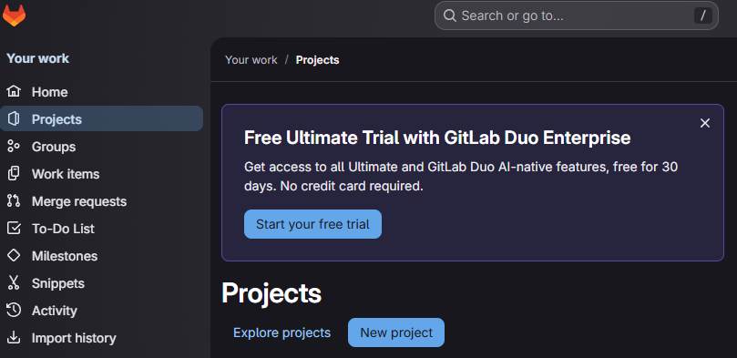

Sitten "Create Blank Project"

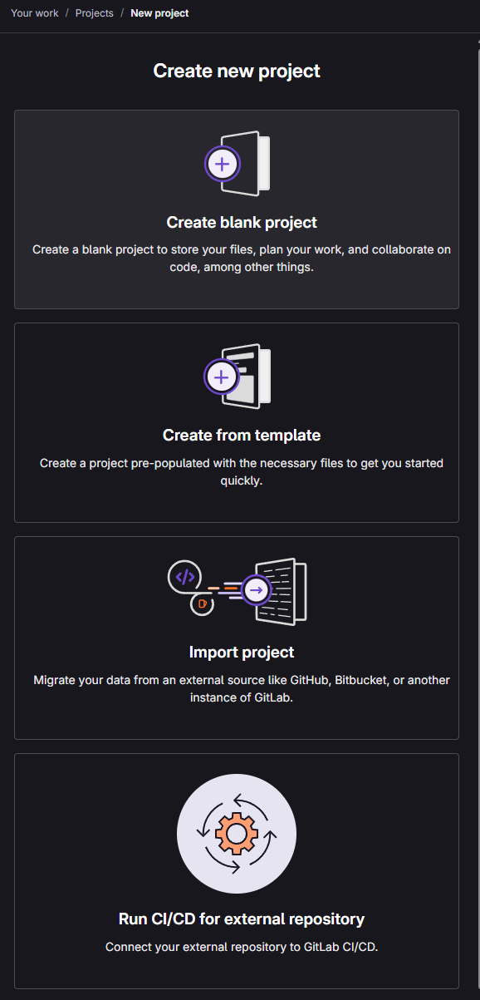

Sitten tiedot. Tässä en voinut lisätä lisenssiä joten painoin vain "Create Project"

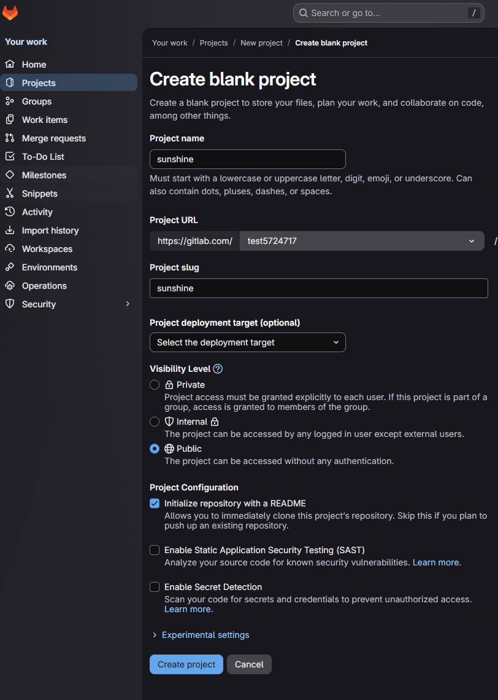

Sitten avautui tällainen näkymä.

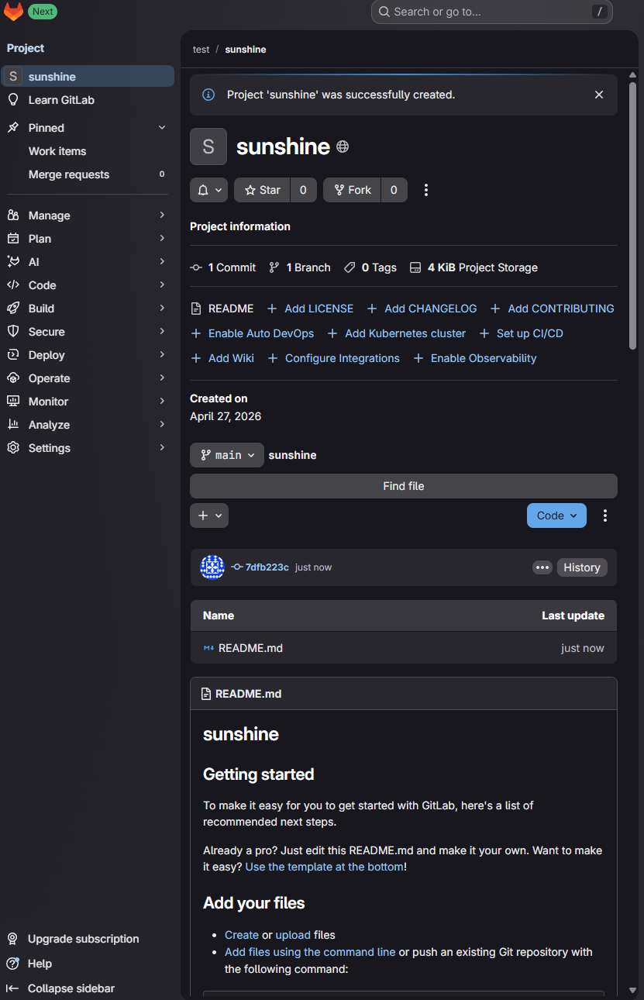

Tällä hetkellä varastossa on jokin valmis README.md tiedosto. Nyt voin myös lisätä lisenssin jos haluaisin.

## b
> Dolly. Kloonaa edellisessä kohdassa tehty uusi varasto itsellesi, tee muutoksia omalla koneella, puske ne palvelimelle, ja näytä, että ne ilmestyvät weppiliittymään.

Klikkasin Code kohtaa, jotta voisin kloonata varaston

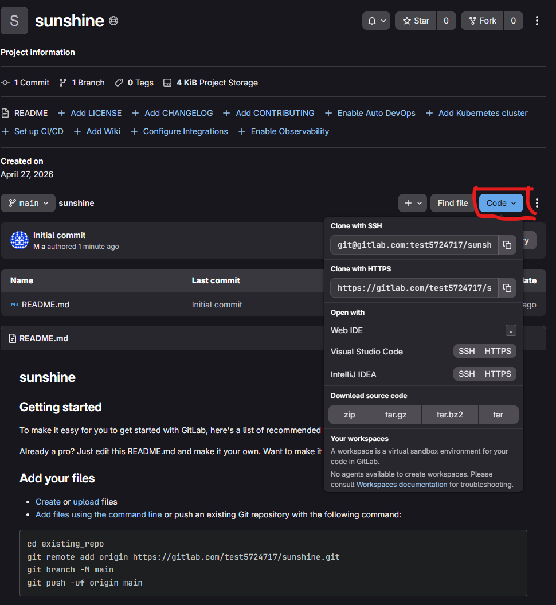

Olin aiemmin lisännyt palveluun ssh avaimeni, joten kloonasin varaston ssh vaihtoehdolla. Tein tämän Windows koneella git bash ohjelmalla, jossa näkyy kätevästi jos jokin kansio on gitissä ja missä branchissa se on

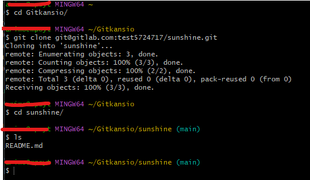

Sitten tein uuden tiedoston ja puskin ne palvelimelle

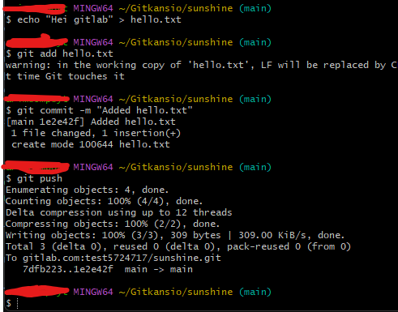

- ``echo "Hei gitlab" > hello.txt`` tein uuden tiedoston hello.txt jossa on teksti "Hei gitlab". 
- ``git add hello.txt`` komennon avulla lisäsin vain tämän tiedoston seuraavaan committiin. Tähän olisi voinut laittaa vaikka ``git add .`` tai `git add --all`, jolloin esimerkiksi mahdolliset muutokset muissa tiedostoissa tulisivat mukaan.
- ` git commit -m "Added hello.txt"` Lisäsin commitin, ja lisäsin siihen kommentin joka kuvaa hyvin tulevaa muutosta.
- `git push` Lopuksi pusku etäiseen varastoon.

Sitten katsoin nettiliittymästä, oliko uusi tiedosto tullut sinne.

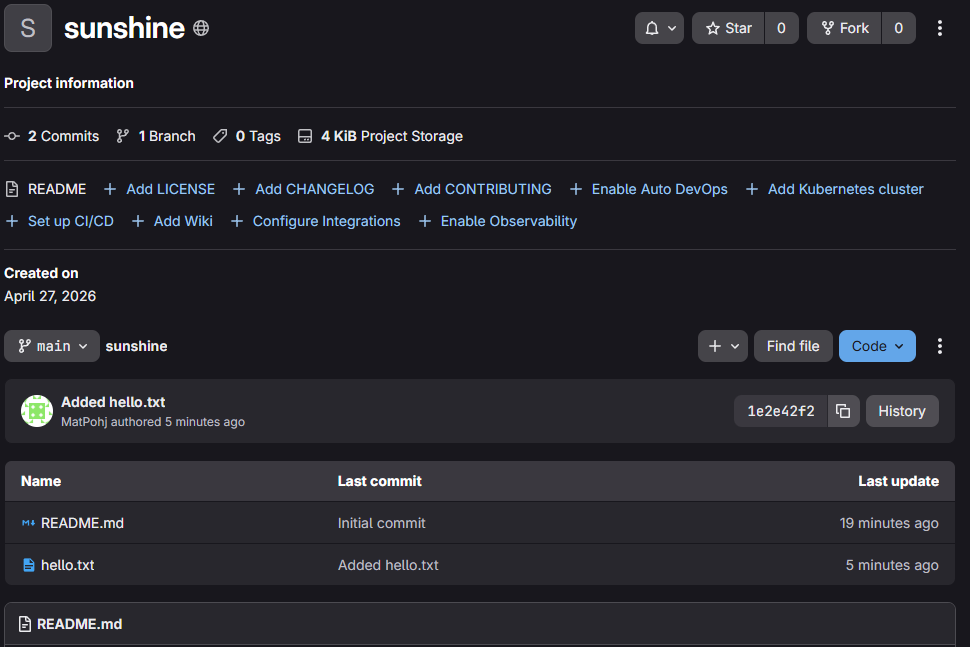

Tiedosto oli tullut myös tänne näkyviin.

## c
> Doh! Tee tyhmä muutos gittiin, älä tee commit:tia. Tuhoa huonot muutokset ‘git reset --hard’. Huomaa, että tässä toiminnossa ei ole peruutusnappia.

Tein seuraavan tempun, jossa näkyisi helposti mitä tämä `git reset --hard` komento tekee.

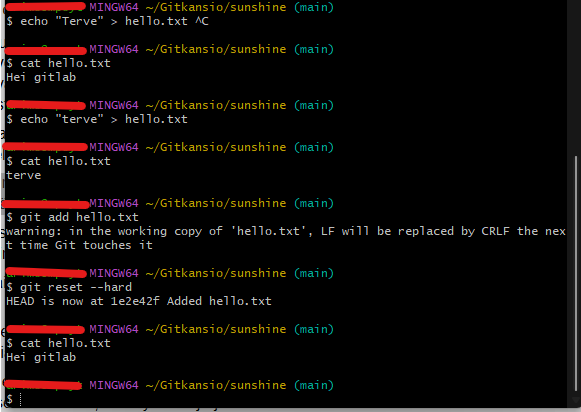

Tässä muokkasin hello.txt sisältöä ja lisäsin sen paikalliseen tietokantaan ``git add``. Tämän jälkeen suoritin komennon `git reset --hard` jonka jälkeen git muokkasi varaston viimeisimmän commitin hetkeen, eli head, joka oli `1e2e42f`. Tässä myös näkyi kommenttini `added hello.txt`. Lopuksi todistin `cat` avulla, että tiedosto oli palautunut alkuperäiseen muotoon.

## d
> Tukki. Tarkastele ja selitä varastosi lokia. Näytä myös, mitä muutoksia tiedostoihin on tehty. Tarkista, että nimesi ja sähköpostiosoitteesi näkyy haluamallasi tavalla ja korjaa tarvittaessa

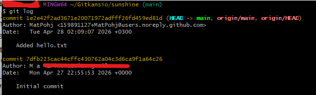

Tässä varastossa oli vain kaksi lokiviestiä. Ensimmäinen oli "Initial commit" eli commit joka tulee, kun tekee varaston. Tässä näkyy Author M a ja sähköposti, joka oli asetettu käyttäjälleni GitLabissa. Kun tekee muutoksia netin kautta, se ei välitä sinun lokaalista git configista.

Toinen oli koneeltani tekemä muutos, kun lisäsin hello.txt tiedoston. Tämä luki sitten tekijän tiedot minun paikallisesta git configista. Tässä näkyy githubin tarjoama noreply sähköposti, jonka avulla voit olla jakamatta oikeaa sähköpostiasi koko maailmalle.

Tämän noreply säköpostin voi löytää githubista käyttäjän asetuksista Emails välilehdeltä

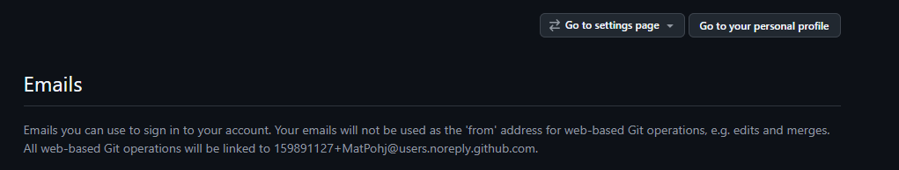

Samalla voi ottaa käyttöön tämän noreply sähköpostin kun tekee muutoksia netin kautta. 

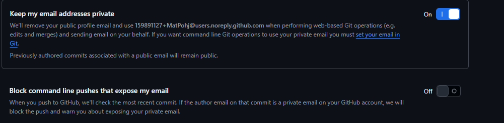

## e
>Gitanbile. Laita Ansible-kansio versionhallintaan. Tee jokin muutos, aja ansiblella, tallenna versio (commit).

Laitoin ansible kansion versionhallintaan `git init` komennolla.

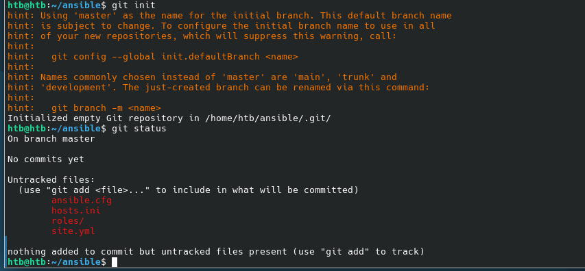

Tämä ei vielä riittänyt, joten tein seuraavat komennot

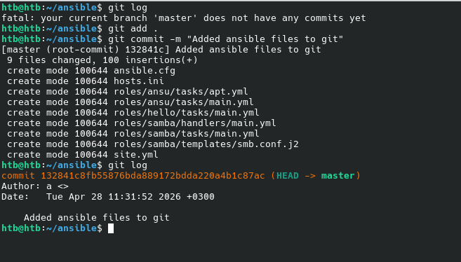

Tässä git logilla näkyy, että se on aluksi tyhjä. Sitten lisäsin kaikki tiedostot ``git add . `` komennola ja tein asiaan kuuluvan commitin. Lopuksi näytin ``git log`` komennolla, että tämä versio on tallennettu.

Tämän jälkeen tein muutoksen aikaisemmassa tehtävässä tehtyyn ``/roles/samba/tasks/main.yml`` tiedostoon, eli muokkasin test file tekstiä

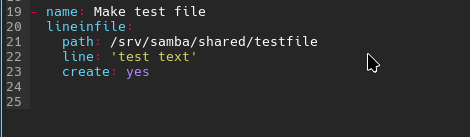

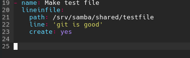

Tämän jälkeen suoritin ansiblen `ansible-playbook site.yml`

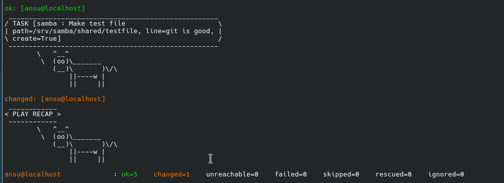

Ja kuten huomataan catin avulla, tiedostoon oli tullut uusi rivi.

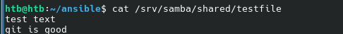

Sitten suoritin seuraavat komennot

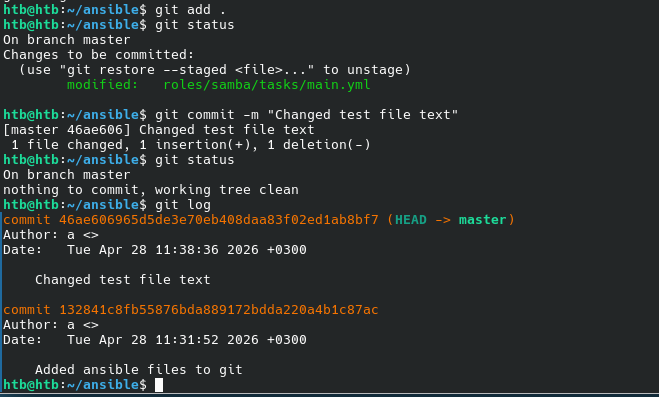

Tässä lisäsin kaikki tiedostot ``git add .``. Tämän jälkeen katsoin gitin statuksen ja se oli huomannut muutoksen vain yhdessä tiedostossa, joten se kertoi tämän tässä. Tämän jälkeen tein commitin, katsoin statuksen ja tämän jälkeen login. Logissa näkyi uusin commit, ``changed test file text`.

## f
> Hae pari projektiin Moodlen keskustelusta. (Tästä alakohdasta f ei tarvitse tehdä vaiheittaista teknistä raporttia, riittää kun toteat, että pari on hankittu.)

Pari on hankittu.

## g

Tässä tehtävässä tein kaikki muut tehtävät Windows käyttöjärjestelmällä, paitsi tehtävän e tein Debianilla. Päätin vielä lisätä ansible kansion aikaisemmassa tehtävässä tehtyyn Gitlabin repositoryyn.

Gitlabin tekemässä README.md tiedostossa oli seuraava vinkki, miten tämä saataisiin tehtyä.

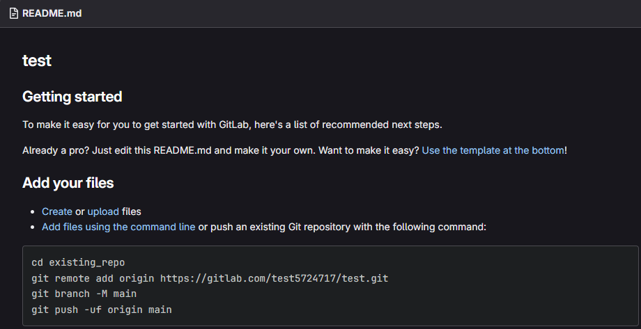

Seuraavaksi suoritin komennot. Huom, remota add kohdassa käytin ssh:ta enkä https/urlia, koska olin autentikoitunut ssh avulla.

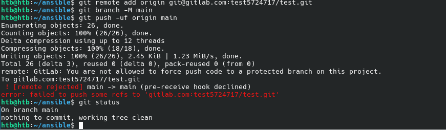

Tuli errori, joka todennäköisesti johtui remot, eli netissä olevassa repositoryssa olevista tiedostoista. Seuraavaksi koitin pullata nämä.

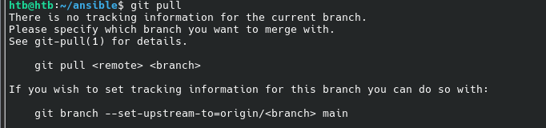

Tämäkin epäonnistui. Aikaisempien kokemusten perusteella ajattelin, että paras tapa olisi vain kloonata repository netistä ja lisätä ansiblen tiedostot siihen ja sitten puskea tämä.

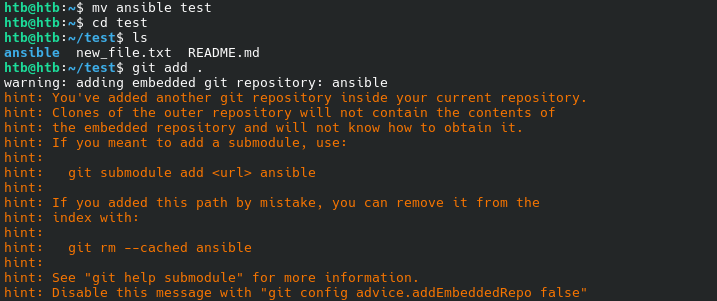

Tässä kohtaa olisi myös kannattanut ehkä kopioida tiedostot eikä siirtää, mutta se ei nyt haittaa. Poistin tämän "remote origin", jonka jälkeen sain tämän toimimaan.

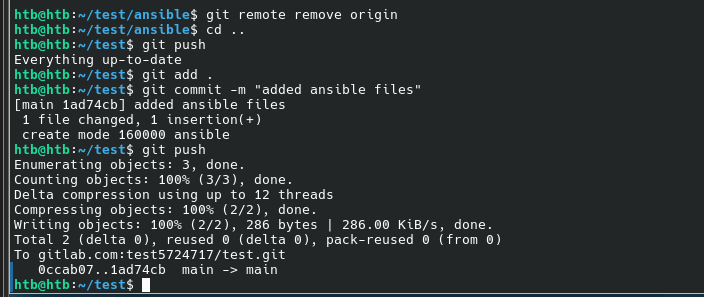

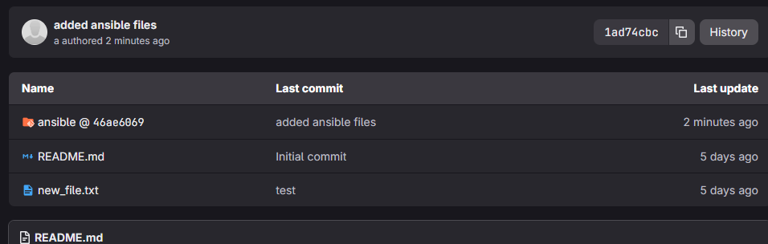

Tai ainaskin niin luulin. Tämä lisäsi tämän ns "submodulena" eli se viittaisi toiseen repositoryyn. Koska tätä ansible repositorya ei ole, ei tämä toimi.

Poistin ansible kansion. Olin aikaisemmin tehnyt kopion ansible kansiossa, joka ei ole git versionhallinnassa. Lisäsin tämän tiedostot tähän `cp -r ansible1 test`.

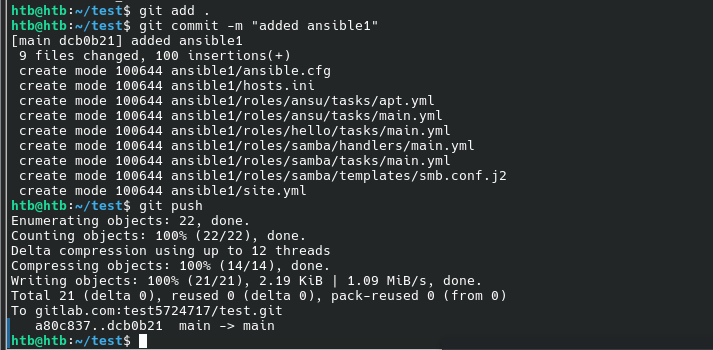

Nyt kansio oli tullut oikeana kansiona, eikä submodulena

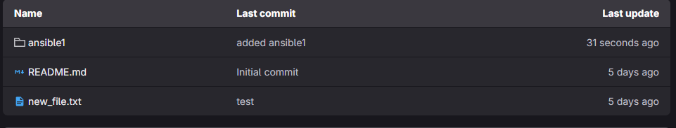

Git on muuten helppo, paitsi jos pitää yhdistää kaksi git kansiota, ainaskin nykyisellä ja aikaisemmalla kokomuksellani. 

## h  
> Vapaaehtoinen: yhteistyötä: anna kaverillesi (tai alter egollesi) oikeus kirjoittaa varastoosi (commit access). Tehkää molemmat muutoksia varastoon gitillä

Tein uuden käyttäjän Gitlabiin. Tämän jälkeen menin pääkäyttäjälleni ja vasemmalta manage-->Members

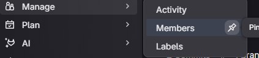

Lisäsin sähköpostin avulla alter egoni ja annoin hänelle maintainer roolin.

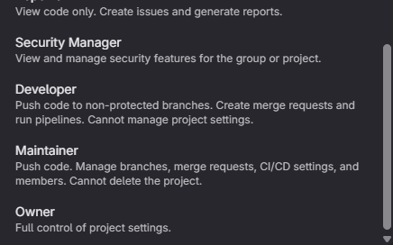

Menin alt käyttäjälleni, Projects välilehdelle ja sieltä Member kohdasta näkyi tämä sunshine repo.

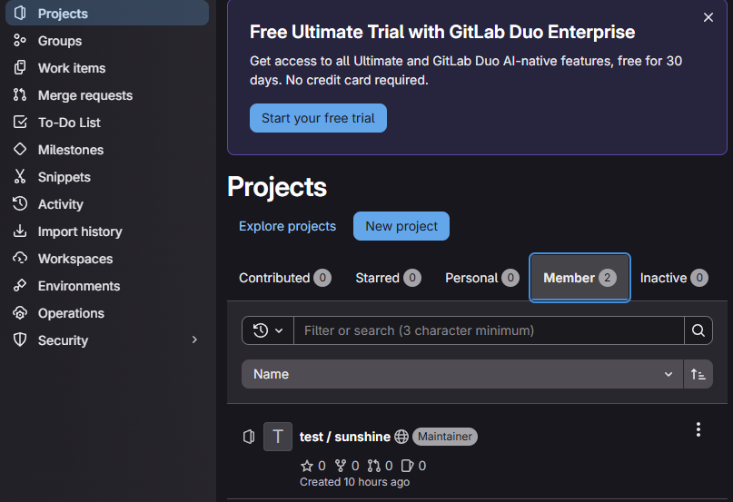

Tein muutoksen hello.txt tiedostoon.

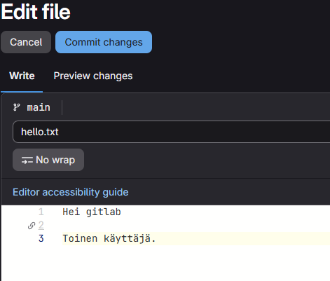

Ja tein puskin tämän.

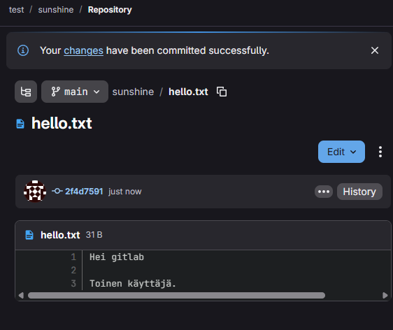

Tämän jälkeen pullasin muutokset tietokoneellani.

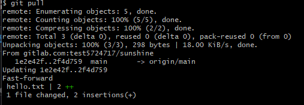

Ja tein itse uusia muutoksia ja puskin nämä.

 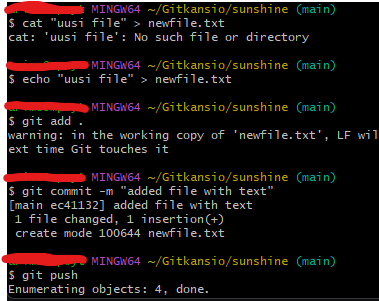

Ja nyt nämä näkyvät repositoryssa

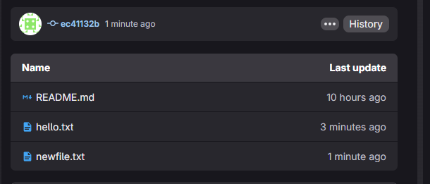

Nämä molemmat tulivat lokeihin.

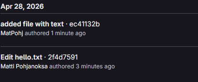

# Lähteet
- Kurssisivu: https://terokarvinen.com/palvelinten-hallinta/
- Chacon and Straub 2014: Pro Git: https://git-scm.com/book/en/v2/Getting-Started-What-is-Git%3F
- Git cheat sheet: https://git-scm.com/cheat-sheet
- 

